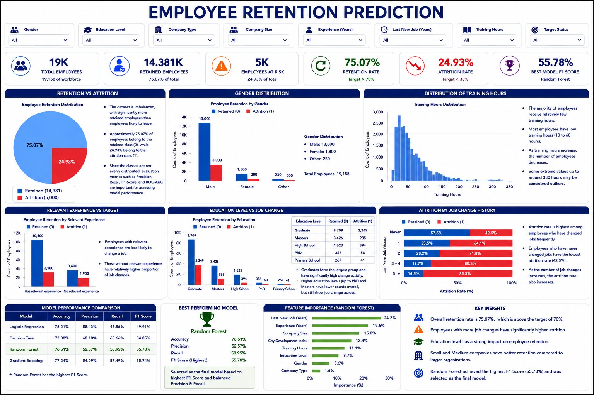

# EMPLOYEE-RETENTION-PREDICTION
Machine Learning to predict employee retention using Logistic Regression, Decision Tree, Random Forest and Ada Boost. It includes EDA, model evaluation and Power BI Dashboard insights .# Data Analyst Portfolio

## About Me
Aspiring Data Analyst with skills in SQL, Excel, Power BI, and Python. Passionate about transforming data into meaningful insights.
## Skills
- SQL
- Power BI
- Excel
- Python
- Data Visualization
### Repository Structure

- Data/ → Dataset
- Dashboard/ → Power BI Dashboard Files
- Presentation/ → Project Presentation
### Employee Retention Prediction
- Built machine learning models to predict employee attrition.
- Models: Logistic Regression, Decision Tree, Random Forest, AdaBoost.
- 
### Model Performance

| Model | Accuracy | Precision | Recall | F1 Score |
|---------|---------|---------|---------|---------|
| Logistic Regression | 77.66% | 59.57% | 32.25% | 41.85% |
| Decision Tree | 70.72% | 42.02% | 46.07% | 43.96% |
| Random Forest | 77.35% | 56.24% | 41.05% | 47.46% |
| AdaBoost | 77.48% | 59.54% | 30.05% | 39.94% |

### Key Insights

- Random Forest achieved the highest F1 Score (47.46%), providing the best balance between Precision and Recall.
- Logistic Regression and AdaBoost achieved similar Accuracy (~77%).
- Decision Tree showed the highest Recall (46.07%), identifying more employees likely to leave.
- Training Hours, Relevant Experience, and Company Size were among the most influential factors affecting employee retention.
### Business Impact

This model helps HR teams identify employees at risk of leaving, enabling proactive retention strategies and reducing employee turnover.
### Power BI Dashboard
- Interactive dashboard for employee retention analysis.
- KPI cards, charts, and insights.
## Dashboard Preview

## Contact
LinkedIn: Amisha Kalra
Email: amishakalra211@gmail.com
